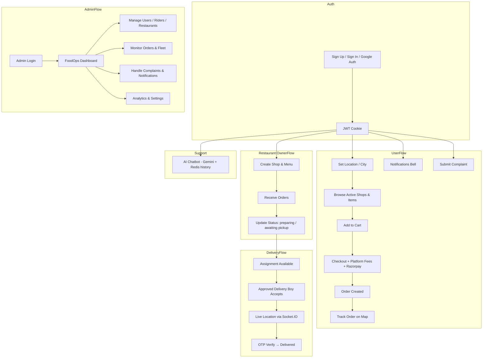

# Food Delivery (Mini Mart)

A full-stack food delivery platform with role-based dashboards for **customers**, **restaurant owners**, and **delivery partners**, plus a dedicated **FoodOps Admin** panel for platform administrators. Users can browse local restaurants, place multi-shop orders, pay via Razorpay, track deliveries in real time on a map, and get help from an AI chatbot powered by Google Gemini.

---

## Table of Contents

- [Overview](#overview)
- [Features](#features)
- [Tech Stack](#tech-stack)
- [App Flow](#app-flow)
- [Project Structure](#project-structure)
- [Prerequisites](#prerequisites)
- [Environment Variables](#environment-variables)
- [Setup](#setup)
- [API Overview](#api-overview)
- [Admin API](#admin-api)
- [Real-Time (Socket.IO)](#real-time-socketio)
- [AI Chatbot](#ai-chatbot)
- [Order Lifecycle](#order-lifecycle)
- [Scripts](#scripts)
- [Author](#author)

---

## Overview

Sangam Delivery connects four user types in a single ecosystem:

| Role | Description |
|------|-------------|
| **User** | Browse food by city, search items, manage cart, checkout, track orders, submit complaints, view notifications, chat with support bot |
| **Owner** | Create and manage a shop, add/edit menu items, accept orders, update preparation status |
| **Delivery Boy** | View assignments, accept deliveries (after admin approval), share live GPS location, verify delivery via OTP |
| **Admin** | Full platform control via the FoodOps Admin Angular dashboard — manage users, riders, restaurants, orders, complaints, notifications, analytics, and platform settings |

The **Backend** is an Express 5 API with MongoDB, Redis, Socket.IO, and integrations for payments (Razorpay), media (Cloudinary), email (Nodemailer), and AI (Gemini). The **Frontend** is a React 19 + Vite SPA with Redux, Tailwind CSS, Leaflet maps, and Firebase for Google sign-in. The **FoodOps Admin** is an Angular 20 SPA with Angular Material, NgRx, and Chart.js.

---

## Features

### Authentication & Account
- Email/password sign-up and sign-in with JWT stored in HTTP-only cookies
- Google OAuth via Firebase
- Forgot password flow with email OTP verification
- Role selection at registration: `user`, `Restaurant Owner`, or `deliveryBoy`
- Location stored per user (GeoJSON point) with city-based discovery
- Account status enforcement: `active`, `deactivated`, `blocked`, `banned` — blocked/banned users cannot sign in
- Delivery boys require admin approval (`isApproved`) before they can accept orders

### Customer (User)
- City-based shop and menu browsing (only `active` shops shown)
- Category filters (Snacks, Pizza, South Indian, etc.)
- Item search
- Shopping cart and multi-shop checkout
- Razorpay payment integration with dynamic delivery fee and GST from platform settings
- Order history with filter tabs (All / Active / Delivered / Cancelled)
- Live order tracking on Leaflet map; cancelled orders show status message instead of map
- Complaint submission with category and optional order reference; view complaint history with status badges
- Notification bell with unread count badge and slide-in drawer (info, warning, promotion, system types)
- Floating AI chatbot for order status, delivery, and platform help

### Restaurant Owner
- Create or edit shop profile with image upload (Cloudinary)
- Add, edit, and delete menu items with images
- View and manage incoming orders
- Update order status: `pending` → `preparing` → `awaiting pickup`
- Dashboard banners for suspended, rejected, and pending shop statuses
- Item ratings

### Delivery Partner
- Admin approval gate — unapproved riders see a pending-approval banner and cannot accept orders
- View available delivery assignments
- Accept orders and manage active delivery
- Real-time GPS broadcast to customers via Socket.IO + Redis
- Delivery completion with OTP verification
- Today's deliveries dashboard with charts (Recharts)
- Cancelled order state handled with dismiss button

### FoodOps Admin Dashboard
- Secure admin-only login (separate JWT, seeded via script)
- Overview stats: total users, active riders, orders, revenue
- **User Management**: list, search, filter, view details, activate/deactivate/block/ban
- **Rider Management**: list, view profile, approve, suspend, activate/deactivate
- **Restaurant Management**: list, view details, approve/reject/suspend/activate
- **Order Management**: list with filters, view details, force cancel, reassign rider, process refund, update status
- **Fleet Monitoring**: online/offline/busy rider counts, average delivery time, delivery heatmap
- **Real-Time Rider Tracking**: live map with rider markers and status popups (Socket.IO)
- **Complaints & Support**: list by type, assign staff, update status, resolve
- **Notifications**: send to users/riders/restaurants by role; create templates; view history
- **Analytics**: revenue, orders, customer growth, rider performance, restaurant performance, peak hours, export reports
- **Platform Settings**: delivery charge config (base + per km + free-above threshold), min order amount, GST, commission

### Platform & Infrastructure
- Centralized API response helpers (`success`, `error`, `unauthorized`)
- Redis for chat history, socket mappings, and delivery location caching
- Rate limiting on chatbot endpoints (20 requests/minute)
- Graceful Redis shutdown on `SIGINT` / `SIGTERM`
- Admin middleware (`isAdmin`) protecting all `/api/admin` routes

---

## Tech Stack

### Frontend (`Frontend/`)

| Category | Technologies |
|----------|--------------|
| Framework | React 19, Vite (rolldown-vite) |
| Routing | React Router DOM 7 |
| State | Redux Toolkit, React Redux |
| Styling | Tailwind CSS 4, Emotion, MUI |
| Maps | Leaflet, React Leaflet, tracking markers |
| HTTP | Axios, Apisauce |
| Real-time | Socket.IO Client |
| Auth | Firebase Auth (Google) |
| Payments | Razorpay checkout (client SDK) |
| UI/UX | Framer Motion, Lucide React, React Icons, React Hook Form |
| Charts | Recharts |

### Backend (`Backend/`)

| Category | Technologies |
|----------|--------------|
| Runtime | Node.js (ES modules) |
| Server | Express 5, HTTP + Socket.IO |
| Database | MongoDB, Mongoose |
| Cache | Redis |
| Auth | JWT, bcryptjs, cookie-parser |
| File upload | Multer → Cloudinary |
| Email | Nodemailer |
| Payments | Razorpay |
| AI | Google Gemini (`@google/genai`) |
| Utilities | chalk, dotenv, express-rate-limit, cors |

### FoodOps Admin (`Foodops-admin/`)

| Category | Technologies |
|----------|--------------|
| Framework | Angular 20 |
| Language | TypeScript |
| UI | Angular Material |
| State | NgRx |
| Real-time | Socket.IO Client |
| Maps | Google Maps |
| Charts | Chart.js |
| Styling | Tailwind CSS, SCSS |
| Auth | JWT (admin-scoped) |

---

## App Flow



### Typical order path

1. **User** adds items from one or more shops → checks out → pays via Razorpay (delivery fee + GST from platform settings).
2. **Owner** sees the order and moves status through preparation stages.
3. System creates a **delivery assignment**; an **approved delivery boy** accepts it.
4. Delivery partner's GPS is streamed to the user's **track order** page.
5. Delivery boy sends OTP; user confirms → order marked **delivered**.

---

## Project Structure

```
main project/
├── Backend/
│   ├── index.js                 # Express app, CORS, routes, server + Socket.IO
│   ├── socket.js                # Real-time: identity, rooms, location updates
│   ├── redis.js                 # Redis client init / shutdown
│   ├── scripts/
│   │   └── seedAdmin.js         # Seed initial admin account
│   ├── config/
│   │   ├── db.js
│   │   └── gemini.js
│   ├── chatbot/
│   │   ├── chatbot.routes.js
│   │   ├── chatbot.controller.js
│   │   ├── chatbot.service.js
│   │   ├── chatbot.memory.js
│   │   ├── chatbot.data.js
│   │   └── chatbot.prompt.js
│   ├── constants/
│   │   └── orderStatus.js       # includes `cancelled`
│   ├── controllers/
│   │   ├── auth.controllers.js
│   │   ├── shop.controller.js
│   │   ├── item.controller.js
│   │   ├── order.controllers.js
│   │   ├── complaint.controller.js
│   │   ├── userNotifications.controller.js
│   │   └── admin/
│   │       ├── adminAuth.controller.js
│   │       ├── adminStats.controller.js
│   │       ├── adminUsers.controller.js
│   │       ├── adminRiders.controller.js
│   │       ├── adminRestaurants.controller.js
│   │       ├── adminOrders.controller.js
│   │       ├── adminFleet.controller.js
│   │       ├── adminComplaints.controller.js
│   │       ├── adminNotifications.controller.js
│   │       ├── adminAnalytics.controller.js
│   │       └── adminSettings.controller.js
│   ├── middlewares/
│   │   ├── isAuth.js
│   │   ├── isAdmin.js           # Admin-only route guard
│   │   ├── multer.js
│   │   └── rateLimiter.js
│   ├── models/
│   │   ├── user.model.js        # includes status, isApproved fields
│   │   ├── shop.model.js        # includes status field
│   │   ├── item.model.js
│   │   ├── order.model.js       # includes cancelled status
│   │   ├── deliveryAssignment.model.js
│   │   ├── admin.model.js
│   │   ├── complaint.model.js
│   │   ├── notification.model.js
│   │   ├── notificationTemplate.model.js
│   │   ├── platformSettings.model.js
│   │   └── response.model.js
│   ├── routes/
│   │   ├── user.routes.js
│   │   ├── shop.routes.js
│   │   ├── item.routes.js
│   │   ├── order.routes.js
│   │   ├── complaint.routes.js
│   │   └── admin/
│   │       ├── admin.auth.routes.js
│   │       ├── admin.stats.routes.js
│   │       ├── admin.users.routes.js
│   │       ├── admin.riders.routes.js
│   │       ├── admin.restaurants.routes.js
│   │       ├── admin.orders.routes.js
│   │       ├── admin.fleet.routes.js
│   │       ├── admin.complaints.routes.js
│   │       ├── admin.notifications.routes.js
│   │       ├── admin.analytics.routes.js
│   │       └── admin.settings.routes.js
│   ├── services/
│   │   └── email.js
│   └── utils/
│       ├── token.js
│       ├── cloudinary.js
│       └── mail.js
│
├── Frontend/
│   ├── index.html
│   ├── vite.config.js
│   ├── tailwind.config.js
│   ├── services/                # complaint.js, notification.js, settings.js + existing
│   ├── utils/                   # Firebase, helpers
│   └── src/
│       ├── main.jsx
│       ├── App.jsx              # Routes + Socket.IO + Chatbot
│       ├── pages/               # Home, SignIn, Cart, Checkout, TrackOrder, MyComplaints, etc.
│       ├── components/          # Dashboards, maps, cards, Chatbot, NotificationDrawer, ComplaintForm
│       ├── hooks/               # Data fetching hooks (incl. useGetPlatformSettings)
│       ├── redux/               # userSlice, ownerSlice, mapSlice, snackbarSlice
│       └── constants/           # categories, orderStatus (incl. cancelled)
│
└── Foodops-admin/
    ├── angular.json
    ├── tailwind.config.js
    └── src/app/
        ├── core/
        │   ├── guards/          # auth.guard, guest.guard
        │   ├── interceptors/    # auth.interceptor, error.interceptor
        │   ├── models/          # admin.model
        │   └── services/        # api.service, auth.service, socket.service
        ├── features/
        │   ├── auth/            # Login page
        │   ├── dashboard/       # Stats overview
        │   ├── users/           # User listing
        │   ├── riders/          # Rider listing + detail
        │   ├── rider-tracking/  # Live map tracking
        │   ├── restaurants/     # Restaurant listing + detail
        │   ├── orders/          # Order listing + detail
        │   ├── fleet/           # Fleet monitoring
        │   ├── complaints/      # Complaints listing + detail
        │   ├── notifications/   # Notification management
        │   ├── analytics/       # Analytics dashboard
        │   ├── settings/        # Platform settings
        │   └── audit-logs/      # Admin action logs
        ├── layouts/
        │   ├── admin-layout/    # Sidebar + topbar shell
        │   └── auth-layout/     # Login shell
        └── shared/
            └── components/      # sidebar, topbar
```

---

## Prerequisites

Before running the project locally, install and configure:

- **Node.js** (v18+ recommended)
- **MongoDB** (local or Atlas)
- **Redis** (local or cloud — required for chatbot memory and delivery tracking)
- **Angular CLI** v21+ (`npm install -g @angular/cli`) — for the admin panel
- Accounts / keys for:
  - [Firebase](https://firebase.google.com/) (Google auth)
  - [Cloudinary](https://cloudinary.com/) (images)
  - [Razorpay](https://razorpay.com/) (payments)
  - [Google AI Studio](https://aistudio.google.com/) (Gemini API key)
  - SMTP email (e.g. Gmail app password) for OTP emails
  - [Geoapify](https://www.geoapify.com/) or similar (reverse geocoding / address search)

---

## Environment Variables

### Backend — `Backend/.env`

```env
PORT=5000
NODE_ENV=development
CLIENT_URL=http://localhost:5173
ADMIN_URL=http://localhost:4200

# Database
MONGO_URL=mongodb://localhost:27017/sangam

# Auth
JWT_SECRET=your_jwt_secret
ADMIN_JWT_SECRET=your_admin_jwt_secret

# Redis
REDIS_URL=redis://localhost:6379
REDIS_PASSWORD=

# Cloudinary
CLOUDINARY_CLOUD_NAME=
CLOUDINARY_API_KEY=
CLOUDINARY_API_SECRET=

# Razorpay
RAZORPAY_API_KEY=
RAZORPAY_API_SECRET=

# Email (OTP / password reset)
EMAIL=your_email@gmail.com
PASSWORD=your_app_password

# Gemini AI
GEMINI_API_KEY=
```

### Frontend — `Frontend/.env`

```env
VITE_SERVER_URL=http://localhost:5000

# Razorpay (public key)
VITE_RAZORPAY_API_KEY=

# Firebase
VITE_FIREBASE_APIKEY=
VITE_AUTH_DOMAIN=
VITE_PROJECT_ID=
VITE_STORAGE_BUCKET=
VITE_MESSAGING_SENDER_ID=
VITE_APP_ID=

# Geocoding (Geoapify example)
VITE_GEOAPI=https://api.geoapify.com/v1/geocode/
VITE_GEOAPI_KEY=
```

### FoodOps Admin — `Foodops-admin/src/environments/environment.ts`

```typescript
export const environment = {
  production: false,
  apiUrl: 'http://localhost:5000/api/admin',
  socketUrl: 'http://localhost:5000',
};
```

> Never commit `.env` files. Add them to `.gitignore` (already ignored in all apps).

---

## Setup

### 1. Clone the repository

```bash
git clone <repository-url>
cd "main project"
```

### 2. Backend

```bash
cd Backend
npm install
```

Create `Backend/.env` using the template above, then seed the admin account and start the server:

```bash
node scripts/seedAdmin.js   # creates the initial admin user
npm run dev
```

The API runs at `http://localhost:5000` by default.

### 3. Frontend

```bash
cd Frontend
npm install
```

Create `Frontend/.env`, then start the dev server:

```bash
npm run dev
```

The app runs at `http://localhost:5173` by default.

### 4. FoodOps Admin

```bash
cd Foodops-admin
npm install
ng serve
```

The admin panel runs at `http://localhost:4200` by default. Log in with the credentials created by `seedAdmin.js`.

### 5. Run everything

Ensure MongoDB and Redis are running, then start Backend, Frontend, and Foodops-admin in separate terminals.

---

## API Overview

Base URL: `{SERVER_URL}/api/auth`

### User (`/user`)

| Method | Endpoint | Auth | Description |
|--------|----------|------|-------------|
| POST | `/signUp` | No | Register |
| POST | `/signIn` | No | Login (returns user with `status` field) |
| GET | `/signOut` | No | Logout |
| POST | `/google-auth` | No | Firebase Google login |
| POST | `/send-otp` | No | Password reset OTP |
| POST | `/verify-otp` | No | Verify OTP |
| POST | `/reset-password` | No | Reset password |
| GET | `/current-user` | Yes | Get logged-in user |
| POST | `/update-location` | Yes | Update user location |
| GET | `/notifications` | Yes | Get user notifications |
| GET | `/settings` | No | Public platform settings (fees, GST) |

### Shop (`/shop`)

| Method | Endpoint | Auth | Description |
|--------|----------|------|-------------|
| POST | `/create-edit` | Yes | Create/update shop (multipart image) |
| GET | `/get-shop` | Yes | Owner's shop |
| GET | `/get-by-city/:city` | Yes | Active shops in city |

### Item (`/item`)

| Method | Endpoint | Auth | Description |
|--------|----------|------|-------------|
| POST | `/create` | Yes | Add menu item |
| PUT | `/edit/:itemId` | Yes | Edit item |
| DELETE | `/delete/:itemId` | Yes | Delete item |
| GET | `/:itemId` | Yes | Item by ID |
| GET | `/get-by-city/:city` | Yes | Items in city |
| GET | `/get-by-shop/:shopId` | Yes | Shop menu |
| GET | `/search-items` | Yes | Search |
| POST | `/rating` | Yes | Rate item |

### Order (`/order`)

| Method | Endpoint | Auth | Description |
|--------|----------|------|-------------|
| POST | `/create` | Yes | Place order |
| POST | `/verify-payment` | Yes | Confirm Razorpay payment |
| GET | `/orders` | Yes | List orders (role-aware) |
| GET | `/order/:orderId` | Yes | Order details |
| POST | `/update-status/:orderId/:shopId` | Yes | Restaurant Owner updates shop order status |
| GET | `/get-assignments` | Yes | Delivery assignments |
| GET | `/accept-order/:assignmentId` | Yes | Accept delivery (requires isApproved) |
| GET | `/current-order` | Yes | Active delivery order |
| POST | `/send-delivery-otp` | Yes | Send delivery OTP |
| POST | `/verify-delivery-otp` | Yes | Complete delivery |
| GET | `/get-today-deliveries` | Yes | Delivery stats |

### Complaints (`/complaints`)

| Method | Endpoint | Auth | Description |
|--------|----------|------|-------------|
| POST | `/` | Yes | Submit complaint |
| GET | `/` | Yes | Get user's complaints |

### Chatbot (`/chat`)

| Method | Endpoint | Auth | Description |
|--------|----------|------|-------------|
| POST | `/chat` | Yes | Send message (rate limited) |
| GET | `/history` | Yes | Get chat history |
| DELETE | `/history` | Yes | Clear chat history |

---

## Admin API

Base URL: `{SERVER_URL}/api/admin` — all routes require admin JWT (`isAdmin` middleware).

### Auth

| Method | Endpoint | Description |
|--------|----------|-------------|
| POST | `/auth/login` | Admin login |
| POST | `/auth/logout` | Admin logout |

### Stats

| Method | Endpoint | Description |
|--------|----------|-------------|
| GET | `/stats` | Platform-wide overview stats |

### Users

| Method | Endpoint | Description |
|--------|----------|-------------|
| GET | `/users` | List users (search, filter, paginate) |
| GET | `/users/:id` | User details + order history |
| PATCH | `/users/:id/status` | Activate / deactivate / block / ban |

### Riders

| Method | Endpoint | Description |
|--------|----------|-------------|
| GET | `/riders` | List riders |
| GET | `/riders/:id` | Rider profile + stats |
| PATCH | `/riders/:id/approve` | Approve rider |
| PATCH | `/riders/:id/status` | Suspend / activate / deactivate |

### Restaurants

| Method | Endpoint | Description |
|--------|----------|-------------|
| GET | `/restaurants` | List restaurants |
| GET | `/restaurants/:id` | Restaurant detail |
| PATCH | `/restaurants/:id/status` | Approve / reject / suspend / activate |

### Orders

| Method | Endpoint | Description |
|--------|----------|-------------|
| GET | `/orders` | List orders with filters |
| GET | `/orders/:id` | Order detail |
| PATCH | `/orders/:id/cancel` | Force cancel |
| PATCH | `/orders/:id/reassign` | Reassign rider |
| PATCH | `/orders/:id/refund` | Process refund |
| PATCH | `/orders/:id/status` | Update status |

### Fleet

| Method | Endpoint | Description |
|--------|----------|-------------|
| GET | `/fleet` | Fleet dashboard metrics |

### Complaints

| Method | Endpoint | Description |
|--------|----------|-------------|
| GET | `/complaints` | List all complaints |
| GET | `/complaints/:id` | Complaint detail |
| PATCH | `/complaints/:id/assign` | Assign to staff |
| PATCH | `/complaints/:id/status` | Update status / resolve |

### Notifications

| Method | Endpoint | Description |
|--------|----------|-------------|
| POST | `/notifications/send` | Send notification to role |
| GET | `/notifications` | Notification history |
| POST | `/notifications/templates` | Create template |

### Analytics

| Method | Endpoint | Description |
|--------|----------|-------------|
| GET | `/analytics` | Revenue, orders, customers, riders, restaurants, peak hours |

### Settings

| Method | Endpoint | Description |
|--------|----------|-------------|
| GET | `/settings` | Get platform settings |
| PATCH | `/settings` | Update delivery charges, GST, commission, min order |

---

## Real-Time (Socket.IO)

Connect to the same host as `VITE_SERVER_URL` (or `socketUrl` in admin) with `withCredentials: true`.

| Event | Direction | Purpose |
|-------|-----------|---------|
| `identity` | Client → Server | Register `userId` with socket; sync delivery orders in Redis |
| `joinOrderRoom` | Client → Server | Join `order:{orderId}` for tracking |
| `leaveOrderRoom` | Client → Server | Leave order room |
| `updateLocation` | Client → Server | Delivery boy GPS → broadcast to order rooms |
| `updateLocationToDB` | Client → Server | Persist delivery boy location to MongoDB |
| `updateDeliveryLocation` | Server → Client | Customer receives live coordinates |

---

## AI Chatbot

- Available only for users with role **`user`** (rendered in `App.jsx`).
- Uses **Google Gemini** (`gemini-1.5-flash-latest`) with a system prompt that includes the user's recent orders (no hallucinated order data).
- Conversation history stored in **Redis** (last 20 messages per user).
- Endpoints protected by `isAuth` and rate limiter (20 req/min).

---

## Order Lifecycle

| Status | Set by | Meaning |
|--------|--------|---------|
| `pending` | System | Order placed |
| `preparing` | Restaurant Owner | Restaurant preparing food |
| `awaiting pickup` | Restaurant Owner | Ready for delivery partner |
| `out for delivery` | System / delivery flow | En route |
| `delivered` | OTP verification | Completed |
| `cancelled` | Admin | Force-cancelled by platform admin |

---

## Scripts

### Backend

| Command | Description |
|---------|-------------|
| `npm run dev` | Start server with nodemon |
| `node scripts/seedAdmin.js` | Seed initial admin account |

### Frontend

| Command | Description |
|---------|-------------|
| `npm run dev` | Vite dev server |
| `npm run build` | Production build |
| `npm run preview` | Preview production build |
| `npm run lint` | ESLint |

### FoodOps Admin

| Command | Description |
|---------|-------------|
| `ng serve` | Angular dev server (port 4200) |
| `ng build` | Production build |
| `ng test` | Unit tests (Vitest) |

---

## Frontend Routes

| Path | Access | Page |
|------|--------|------|
| `/` | Authenticated | Role-based home dashboard |
| `/signIn` | Guest | Sign in |
| `/signUp` | Guest | Sign up |
| `/forgot-password` | Guest | Password reset |
| `/create-edit-shop` | Authenticated | Shop setup |
| `/add-item`, `/edit-item/:itemId` | Authenticated | Menu management |
| `/shop/:shopId` | Authenticated | Shop detail |
| `/cart` | Authenticated | Cart |
| `/checkOut` | Authenticated | Checkout & payment |
| `/order-placed` | Authenticated | Confirmation |
| `/my-orders` | Authenticated | Order list with filter tabs |
| `/track-order/:orderId` | Authenticated | Live map tracking |
| `/my-complaints` | Authenticated | Complaint history |

## Admin Routes (FoodOps Admin — port 4200)

| Path | Page |
|------|------|
| `/login` | Admin login |
| `/dashboard` | Stats overview |
| `/users` | User management |
| `/riders` | Rider management |
| `/rider-tracking` | Live fleet map |
| `/restaurants` | Restaurant management |
| `/orders` | Order management |
| `/fleet` | Fleet monitoring |
| `/complaints` | Complaints & support |
| `/notifications` | Notification center |
| `/analytics` | Analytics dashboard |
| `/settings` | Platform settings |
| `/audit-logs` | Admin action logs |

---

## Author

**Lavish Dadwani**

---

## License

ISC (Backend). Frontend and FoodOps Admin are private (`"private": true` in `package.json`).
