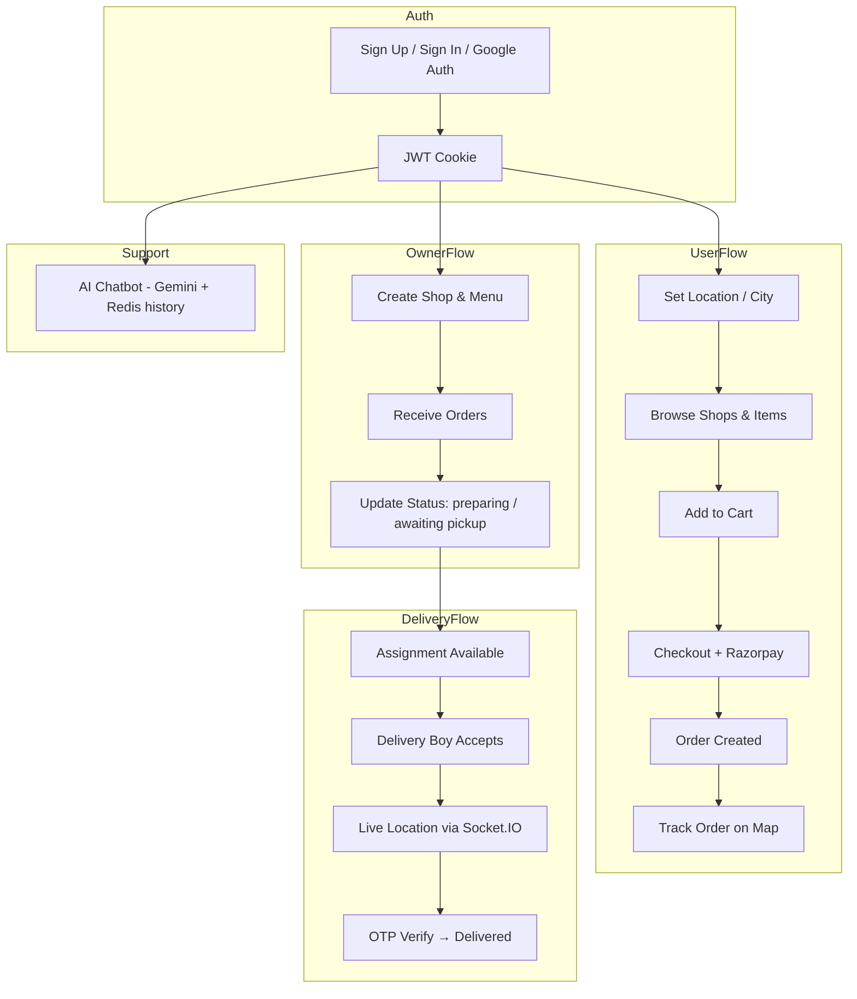

# Food Delivery (Mini Mart)

A full-stack food delivery platform with role-based dashboards for **customers**, **restaurant owners**, and **delivery partners**. Users can browse local restaurants, place multi-shop orders, pay via Razorpay, track deliveries in real time on a map, and get help from an AI chatbot powered by Google Gemini.

---

## Table of Contents

- [Overview](#overview)
- [Features](#features)
- [Tech Stack](#tech-stack)
- [App Flow](#app-flow)
- [Project Structure](#project-structure)
- [Prerequisites](#prerequisites)
- [Environment Variables](#environment-variables)
- [Setup](#setup)
- [API Overview](#api-overview)
- [Real-Time (Socket.IO)](#real-time-socketio)
- [AI Chatbot](#ai-chatbot)
- [Order Lifecycle](#order-lifecycle)
- [Scripts](#scripts)
- [Author](#author)

---

## Overview

Sangam Delivery connects three user types in a single application:

| Role | Description |
|------|-------------|
| **User** | Browse food by city, search items, manage cart, checkout, track orders, chat with support bot |
| **Owner** | Create and manage a shop, add/edit menu items, accept orders, update preparation status |
| **Delivery Boy** | View assignments, accept deliveries, share live GPS location, verify delivery via OTP |

The **Backend** is an Express 5 API with MongoDB, Redis, Socket.IO, and integrations for payments (Razorpay), media (Cloudinary), email (Nodemailer), and AI (Gemini). The **Frontend** is a React 19 + Vite SPA with Redux, Tailwind CSS, Leaflet maps, and Firebase for Google sign-in.

---

## Features

### Authentication & Account
- Email/password sign-up and sign-in with JWT stored in HTTP-only cookies
- Google OAuth via Firebase
- Forgot password flow with email OTP verification
- Role selection at registration: `user`, `owner`, or `deliveryBoy`
- Location stored per user (GeoJSON point) with city-based discovery

### Customer (User)
- City-based shop and menu browsing
- Category filters (Snacks, Pizza, South Indian, etc.)
- Item search
- Shopping cart and multi-shop checkout
- Razorpay payment integration
- Order history and live order tracking on Leaflet map
- Floating AI chatbot for order status, delivery, and platform help

### Restaurant Owner
- Create or edit shop profile with image upload (Cloudinary)
- Add, edit, and delete menu items with images
- View and manage incoming orders
- Update order status: `pending` → `preparing` → `awaiting pickup`
- Item ratings

### Delivery Partner
- View available delivery assignments
- Accept orders and manage active delivery
- Real-time GPS broadcast to customers via Socket.IO + Redis
- Delivery completion with OTP verification
- Today’s deliveries dashboard with charts (Recharts)

### Platform & Infrastructure
- Centralized API response helpers (`success`, `error`, `unauthorized`)
- Redis for chat history, socket mappings, and delivery location caching
- Rate limiting on chatbot endpoints (20 requests/minute)
- Graceful Redis shutdown on `SIGINT` / `SIGTERM`

---

## Tech Stack

### Frontend (`Frontend/`)

| Category | Technologies |
|----------|--------------|
| Framework | React 19, Vite (rolldown-vite) |
| Routing | React Router DOM 7 |
| State | Redux Toolkit, React Redux |
| Styling | Tailwind CSS 4, Emotion, MUI |
| Maps | Leaflet, React Leaflet, tracking markers |
| HTTP | Axios, Apisauce |
| Real-time | Socket.IO Client |
| Auth | Firebase Auth (Google) |
| Payments | Razorpay checkout (client SDK) |
| UI/UX | Framer Motion, Lucide React, React Icons, React Hook Form |
| Charts | Recharts |

### Backend (`Backend/`)

| Category | Technologies |
|----------|--------------|
| Runtime | Node.js (ES modules) |
| Server | Express 5, HTTP + Socket.IO |
| Database | MongoDB, Mongoose |
| Cache | Redis |
| Auth | JWT, bcryptjs, cookie-parser |
| File upload | Multer → Cloudinary |
| Email | Nodemailer |
| Payments | Razorpay |
| AI | Google Gemini (`@google/genai`) |
| Utilities | chalk, dotenv, express-rate-limit, cors |

---

## App Flow



### Typical order path

1. **User** adds items from one or more shops → checks out → pays via Razorpay.
2. **Owner** sees the order and moves status through preparation stages.
3. System creates a **delivery assignment**; a **delivery boy** accepts it.
4. Delivery partner’s GPS is streamed to the user’s **track order** page.
5. Delivery boy sends OTP; user confirms → order marked **delivered**.

---

## Project Structure

```
main project/
├── Backend/
│   ├── index.js                 # Express app, CORS, routes, server + Socket.IO
│   ├── socket.js                # Real-time: identity, rooms, location updates
│   ├── redis.js                 # Redis client init / shutdown
│   ├── config/
│   │   ├── db.js                # MongoDB connection
│   │   └── gemini.js            # Google Gemini client
│   ├── chatbot/
│   │   ├── chatbot.routes.js
│   │   ├── chatbot.controller.js
│   │   ├── chatbot.service.js   # Gemini chat + history
│   │   ├── chatbot.memory.js    # Redis chat history
│   │   ├── chatbot.data.js      # User orders for context
│   │   └── chatbot.prompt.js    # System prompt
│   ├── constants/
│   │   └── orderStatus.js
│   ├── controllers/
│   │   ├── auth.controllers.js
│   │   ├── shop.controller.js
│   │   ├── item.controller.js
│   │   └── order.controllers.js
│   ├── middlewares/
│   │   ├── isAuth.js
│   │   ├── multer.js
│   │   └── rateLimiter.js
│   ├── models/
│   │   ├── user.model.js
│   │   ├── shop.model.js
│   │   ├── item.model.js
│   │   ├── order.model.js
│   │   ├── deliveryAssignment.model.js
│   │   └── response.model.js
│   ├── routes/
│   │   ├── user.routes.js
│   │   ├── shop.routes.js
│   │   ├── item.routes.js
│   │   └── order.routes.js
│   ├── services/
│   │   └── email.js
│   └── utils/
│       ├── token.js
│       ├── cloudinary.js
│       └── mail.js
│
└── Frontend/
    ├── index.html
    ├── vite.config.js
    ├── tailwind.config.js
    ├── services/                # API clients (config, order, shop, item, chatbot)
    ├── utils/                   # Firebase, helpers
    └── src/
        ├── main.jsx
        ├── App.jsx              # Routes + Socket.IO + Chatbot
        ├── pages/               # Home, SignIn, Cart, Checkout, TrackOrder, etc.
        ├── components/          # Dashboards, maps, cards, Chatbot
        ├── hooks/               # Data fetching hooks
        ├── redux/               # userSlice, ownerSlice, mapSlice, snackbarSlice
        └── constants/           # categories, orderStatus
```

---

## Prerequisites

Before running the project locally, install and configure:

- **Node.js** (v18+ recommended)
- **MongoDB** (local or Atlas)
- **Redis** (local or cloud — optional but required for chatbot memory and optimized delivery tracking)
- Accounts / keys for:
  - [Firebase](https://firebase.google.com/) (Google auth)
  - [Cloudinary](https://cloudinary.com/) (images)
  - [Razorpay](https://razorpay.com/) (payments)
  - [Google AI Studio](https://aistudio.google.com/) (Gemini API key)
  - SMTP email (e.g. Gmail app password) for OTP emails
  - [Geoapify](https://www.geoapify.com/) or similar (reverse geocoding / address search)

---

## Environment Variables

### Backend — `Backend/.env`

```env
PORT=5000
NODE_ENV=development
CLIENT_URL=http://localhost:5173

# Database
MONGO_URL=mongodb://localhost:27017/sangam

# Auth
JWT_SECRET=your_jwt_secret

# Redis
REDIS_URL=redis://localhost:6379
REDIS_PASSWORD=

# Cloudinary
CLOUDINARY_CLOUD_NAME=
CLOUDINARY_API_KEY=
CLOUDINARY_API_SECRET=

# Razorpay
RAZORPAY_API_KEY=
RAZORPAY_API_SECRET=

# Email (OTP / password reset)
EMAIL=your_email@gmail.com
PASSWORD=your_app_password

# Gemini AI
GEMINI_API_KEY=
```

### Frontend — `Frontend/.env`

```env
VITE_SERVER_URL=http://localhost:5000

# Razorpay (public key)
VITE_RAZORPAY_API_KEY=

# Firebase
VITE_FIREBASE_APIKEY=
VITE_AUTH_DOMAIN=
VITE_PROJECT_ID=
VITE_STORAGE_BUCKET=
VITE_MESSAGING_SENDER_ID=
VITE_APP_ID=

# Geocoding (Geoapify example)
VITE_GEOAPI=https://api.geoapify.com/v1/geocode/
VITE_GEOAPI_KEY=
```

> Never commit `.env` files. Add them to `.gitignore` (already ignored in both apps).

---

## Setup

### 1. Clone the repository

```bash
git clone <repository-url>
cd "main project"
```

### 2. Backend

```bash
cd Backend
npm install
```

Create `Backend/.env` using the template above, then start the server:

```bash
npm run dev
```

The API runs at `http://localhost:5000` by default. Health check: `GET /` → `{ "message": "Server is running" }`.

### 3. Frontend

```bash
cd Frontend
npm install
```

Create `Frontend/.env`, then start the dev server:

```bash
npm run dev
```

The app runs at `http://localhost:5173` by default.

### 4. Run together

Ensure MongoDB and Redis are running, then start Backend and Frontend in separate terminals. Sign up with a role and use the app according to that role’s dashboard on `/`.

---

## API Overview

Base URL: `{SERVER_URL}/api/auth`

### User (`/user`)

| Method | Endpoint | Auth | Description |
|--------|----------|------|-------------|
| POST | `/signUp` | No | Register |
| POST | `/signIn` | No | Login |
| GET | `/signOut` | No | Logout |
| POST | `/google-auth` | No | Firebase Google login |
| POST | `/send-otp` | No | Password reset OTP |
| POST | `/verify-otp` | No | Verify OTP |
| POST | `/reset-password` | No | Reset password |
| GET | `/current-user` | Yes | Get logged-in user |
| POST | `/update-location` | Yes | Update user location |

### Shop (`/shop`)

| Method | Endpoint | Auth | Description |
|--------|----------|------|-------------|
| POST | `/create-edit` | Yes | Create/update shop (multipart image) |
| GET | `/get-shop` | Yes | Owner’s shop |
| GET | `/get-by-city/:city` | Yes | Shops in city |

### Item (`/item`)

| Method | Endpoint | Auth | Description |
|--------|----------|------|-------------|
| POST | `/create` | Yes | Add menu item |
| PUT | `/edit/:itemId` | Yes | Edit item |
| DELETE | `/delete/:itemId` | Yes | Delete item |
| GET | `/:itemId` | Yes | Item by ID |
| GET | `/get-by-city/:city` | Yes | Items in city |
| GET | `/get-by-shop/:shopId` | Yes | Shop menu |
| GET | `/search-items` | Yes | Search |
| POST | `/rating` | Yes | Rate item |

### Order (`/order`)

| Method | Endpoint | Auth | Description |
|--------|----------|------|-------------|
| POST | `/create` | Yes | Place order |
| POST | `/verify-payment` | Yes | Confirm Razorpay payment |
| GET | `/orders` | Yes | List orders (role-aware) |
| GET | `/order/:orderId` | Yes | Order details |
| POST | `/update-status/:orderId/:shopId` | Yes | Owner updates shop order status |
| GET | `/get-assignments` | Yes | Delivery assignments |
| GET | `/accept-order/:assignmentId` | Yes | Accept delivery |
| GET | `/current-order` | Yes | Active delivery order |
| POST | `/send-delivery-otp` | Yes | Send delivery OTP |
| POST | `/verify-delivery-otp` | Yes | Complete delivery |
| GET | `/get-today-deliveries` | Yes | Delivery stats |

### Chatbot (`/chat`)

| Method | Endpoint | Auth | Description |
|--------|----------|------|-------------|
| POST | `/chat` | Yes | Send message (rate limited) |
| GET | `/history` | Yes | Get chat history |
| DELETE | `/history` | Yes | Clear chat history |

---

## Real-Time (Socket.IO)

Connect to the same host as `VITE_SERVER_URL` with `withCredentials: true`.

| Event | Direction | Purpose |
|-------|-----------|---------|
| `identity` | Client → Server | Register `userId` with socket; sync delivery orders in Redis |
| `joinOrderRoom` | Client → Server | Join `order:{orderId}` for tracking |
| `leaveOrderRoom` | Client → Server | Leave order room |
| `updateLocation` | Client → Server | Delivery boy GPS → broadcast to order rooms |
| `updateLocationToDB` | Client → Server | Persist delivery boy location to MongoDB |
| `updateDeliveryLocation` | Server → Client | Customer receives live coordinates |

---

## AI Chatbot

- Available only for users with role **`user`** (rendered in `App.jsx`).
- Uses **Google Gemini** (`gemini-1.5-flash-latest`) with a system prompt that includes the user’s recent orders (no hallucinated order data).
- Conversation history stored in **Redis** (last 20 messages per user).
- Endpoints protected by `isAuth` and rate limiter (20 req/min).

---

## Order Lifecycle

| Status | Set by | Meaning |
|--------|--------|---------|
| `pending` | System | Order placed |
| `preparing` | Owner | Restaurant preparing food |
| `awaiting pickup` | Owner | Ready for delivery partner |
| `out for delivery` | System / delivery flow | En route |
| `delivered` | OTP verification | Completed |

---

## Scripts

### Backend

| Command | Description |
|---------|-------------|
| `npm run dev` | Start server with nodemon |

### Frontend

| Command | Description |
|---------|-------------|
| `npm run dev` | Vite dev server |
| `npm run build` | Production build |
| `npm run preview` | Preview production build |
| `npm run lint` | ESLint |

---

## Frontend Routes

| Path | Access | Page |
|------|--------|------|
| `/` | Authenticated | Role-based home dashboard |
| `/signIn` | Guest | Sign in |
| `/signUp` | Guest | Sign up |
| `/forgot-password` | Guest | Password reset |
| `/create-edit-shop` | Authenticated | Shop setup |
| `/add-item`, `/edit-item/:itemId` | Authenticated | Menu management |
| `/shop/:shopId` | Authenticated | Shop detail |
| `/cart` | Authenticated | Cart |
| `/checkOut` | Authenticated | Checkout & payment |
| `/order-placed` | Authenticated | Confirmation |
| `/my-orders` | Authenticated | Order list |
| `/track-order/:orderId` | Authenticated | Live map tracking |

---

## Author

**Lavish Dadwani**

---

## License

ISC (Backend). Frontend is private (`"private": true` in `package.json`).
